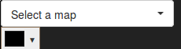

## About this tutorial

This tutorial builds upon the tutorial *Exploring Maps On Canvas*, which can be found in this tutorial series.
Currently, we are able to select a map, we want to see. Now we want to enrich the application by adding a color picker, which allows us to select the feature border color of the displayed map.
New sections are marked with *New Start* and *New End*.

### Let's start

As in the previous example, we are starting with the index.html. We are adding [spectrum](https://github.com/bgrins/spectrum), a nice and very well documented library for color picking.


```html
<html>

<head>
  <title>geocure REST API Demo Client</title>
  <meta charset="utf-8">
  <meta name="viewport" content="width=device-width, initial-scale=1.0">
  <link rel="stylesheet" href="https://cdnjs.cloudflare.com/ajax/libs/bootstrap-select/1.12.4/css/bootstrap-select.min.css">
  <link rel="stylesheet" href="https://maxcdn.bootstrapcdn.com/bootstrap/3.3.7/css/bootstrap.min.css">
  <!-- New Start-->
  <link rel="stylesheet" type="text/css" href="https://cdnjs.cloudflare.com/ajax/libs/spectrum/1.8.0/spectrum.min.css">
  <!-- New End  -->
  <link rel="stylesheet" href="css/style.css" />

  <script src="https://code.jquery.com/jquery-3.1.1.min.js"></script>
  <script src="https://maxcdn.bootstrapcdn.com/bootstrap/3.3.7/js/bootstrap.min.js"></script>
  <script src="https://cdnjs.cloudflare.com/ajax/libs/bootstrap-select/1.12.4/js/bootstrap-select.min.js"></script>
  <!-- New Start-->
  <script src="https://cdnjs.cloudflare.com/ajax/libs/spectrum/1.8.0/spectrum.min.js"></script>
  <!-- New End -->

  <script src="js/app.js"></script>
</head>

<body>
  <nav class="navbar navbar-toggleable-md navbar-inverse bg-inverse fixed-top">
    <div>
      <select class="selectpicker" , id="availableMaps">
      <option>Select a map</option>
    </select>
    </div>
    <!-- New Start  -->
    <div id="showPaletteOnly">
      <input id='colorpicker' />
    </div>
    <!-- New ned -->
  </nav>

  <div class="row">
    <div class="col-12">
      <div id="outer">
        <div id='canvas-container'><canvas id="mapCanvas" height="1500" width="1500"></canvas></div>
      </div>
    </div>
  </div>

</body>

<!-- Modal -->
<!-- Addapted from https://www.w3schools.com/bootstrap/bootstrap_modal.asp -->
<div class="modal fade" id="myModal" role="dialog">
  <div class="modal-dialog">
    <!-- Modal content-->
    <div class="modal-content">
      <div class="modal-header">
        <button type="button" class="close" data-dismiss="modal">&times;</button>
        <h4 class="modal-title">Response from getFeatureInfo</h4>
      </div>
      <div class="modal-body">
        <pre id="json"></pre>
      </div>
      <div class="modal-footer">
        <button type="button" class="btn btn-default" data-dismiss="modal">Close</button>
      </div>
    </div>
  </div>
</div>

</html>
```

At the beginning of the window.onload function, we initialize the color picker.

```javascript
window.onload = function() {

  // New Start
  $("#colorpicker").spectrum({
      showPaletteOnly: true,
      showPalette:true,
      hideAfterPaletteSelect:true,
      color: 'black',
      palette: [
          ['red', 'black', 'green', 'blue', 'violet']
      ]
  });
  // New End

  getAvailableMaps()
    .then(addMapsToSelectOptions)
    .then(selectedMapAction).catch(error => {alert('error: ' + error)});
}

```

Reference-style:


Now we have to take two cases into account:
  - The selected map changes.
  - The selected color changes.

We have already dealt with changes on of the map. So let us start with this function (exchangeMapOnCanvas(linkToMap)) and have a look what we have to change.
First of all, let us have a look at the unchanged function:

```javascript
function exchangeMapOnCanvas(linkToMap) {
  return new Promise((resolve, reject) => {
    try {

        // size is the one from the canvas
        let size = '&height=' + $('#mapCanvas').attr('height') + '&width=' + $('#mapCanvas').attr('width');

        let imageRequestURL = linkToMap + size;
        console.log(imageRequestURL);

        var canvas =document.getElementById('mapCanvas');
        var context = canvas.getContext('2d');


        var imageObj = new Image();
        imageObj.onload = function() {
          context.drawImage(this, 0, 0);
          resolve(linkToMap);
        };
        imageObj.src = imageRequestURL;

    }
    catch(error) {
      reject(error);
    }
  });
};
```
*imageRequestURL* contains the url for the request. Currently, only width and height are added as a query parameter.
Now we want to add styling. For this we are writing a function, which returns the currently missing part of the url:

```javascript
function style(layerId) {
 let openStyle = '<StyledLayerDescriptor version="1.3.0" xsi:schemaLocation="http://schemas.opengis.net/sld/1.3.0/StyledLayerDescriptor.xsd" xmlns="http://www.opengis.net/sld" xmlns:ogc="http://www.opengis.net/ogc" xmlns:xlink="http://www.w3.org/1999/xlink" xmlns:xsi="http://www.w3.org/2001/XMLSchema-instance"> '
 let openNamedLayer = '<NamedLayer>';
 let name = '<Name>' + layerId + '</Name>';
 let openUserStyleStroke = '<UserStyle><Title>SLD Cook Book: Simple polygon</Title><FeatureTypeStyle><Rule><PolygonSymbolizer><Stroke>;'
 let strokeColor = '<CssParameter name="stroke">' + $("#colorpicker").spectrum("get").toHexString() + '</CssParameter>';
 let closeUserStyleStroke = '</Stroke></PolygonSymbolizer></Rule></FeatureTypeStyle></UserStyle>';
 let closeNamedLayer = '</NamedLayer>';
 let closeStyle = '</StyledLayerDescriptor>'

 return '&sld=' + encodeURIComponent(openStyle + openNamedLayer + name + openUserStyleStroke + strokeColor + strokeWidth + closeUserStyleStroke + closeNamedLayer + closeStyle);
}
```

We are constructing a style according to the [GeoServers styling cookbook.](http://docs.geoserver.org/stable/en/user/styling/sld/cookbook/).
The variable *name* contains the layerId of the layer we want to style.
In *strokeColor* we are asking our colorpicker to give us the value of the currently selected color.
The rest ist static xml.

Adding this to our request URL is simple:

```javascript
function exchangeMapOnCanvas(linkToMap) {
  return new Promise((resolve, reject) => {
    try {

        // size is the one from the canvas
        let size = '&height=' + $('#mapCanvas').attr('height') + '&width=' + $('#mapCanvas').attr('width');

        // New Start
        let imageRequestURL = linkToMap + size + style(linkToMap.match(/layer=[^&]*/)[0].replace('layer=', ''));
        // New End
        console.log(imageRequestURL);

        var canvas =document.getElementById('mapCanvas');
        var context = canvas.getContext('2d');


        var imageObj = new Image();
        imageObj.onload = function() {
          context.drawImage(this, 0, 0);
          resolve(linkToMap);
        };
        imageObj.src = imageRequestURL;

    }
    catch(error) {
      reject(error);
    }
  });
};
```

We pass to the function the id of the requested layer. This is extracted via regular expressions from our already existing URL par.
Now if we select a map, the feature borders will be drawn with the selected color.
What is missing, is the reloading of the image on color change.
For this, we need an eventlisteners at the color picker.
The change event of the color picker is used to trigger the change event of the map selection. So the map will be drawn again with the newly selected color. We accomplish this by just one short additon of the color picker setup:

```javascript
$("#colorpicker").spectrum({
    showPaletteOnly: true,
    showPalette:true,
    hideAfterPaletteSelect:true,
    color: 'black',
    palette: [
        ['red', 'black', 'green', 'blue', 'violet']
    ],
    // New Start
    change: () => {$('#availableMaps').trigger('change')}
    // New End
});
```

## The Result
In this tutorial, we have demonstrated, that applying styles to a map request via geocure is also very easy.
Of course, the styles can become even more complex. Youst have a look at [GeoServers styling cookbook.](http://docs.geoserver.org/stable/en/user/styling/sld/cookbook/).
